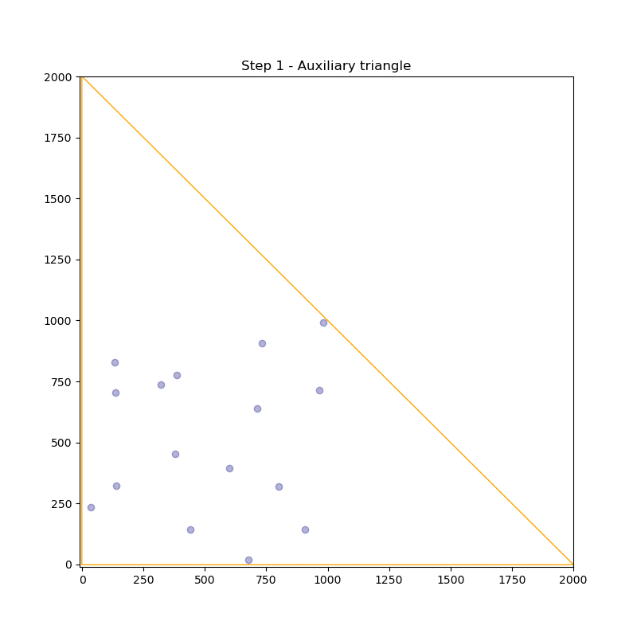

Visualize k-d tree
---

This repository contains visualization of 2D k-d tree through `jupyter notebook` and `matplotlib`. 

# Installation

```
pip install -r requirements.txt
```

# Run

Execute command
```
jupyter notebook 
```

which opens your default browser and select `kdtree-visualization` notebook. Other instructions can be found in the notebook. 

Code is not intended to run outside of the notebook. 

# Result



# Code Structure

- `kdtree.py` - K-d tree and its utils. Algorithm itself originates from wikipedia but was adapted.
- `animplayer.py` - Code using `matplotlib`'s `FuncAnimations` to create interactive chart.
- `drawing` - Code used to draw results of kd tree using `matplotlib` and `animplayer` to draw resutls
- `kdtree-visualization.ipynb` - Notebook with the visualizations putting all the modules together.

# References

- Algorithm
  - https://en.wikipedia.org/wiki/K-d_tree
- Animations
  - https://towardsdatascience.com/animations-with-matplotlib-d96375c5442c
  - https://towardsdatascience.com/matplotlib-animations-in-jupyter-notebook-4422e4f0e389